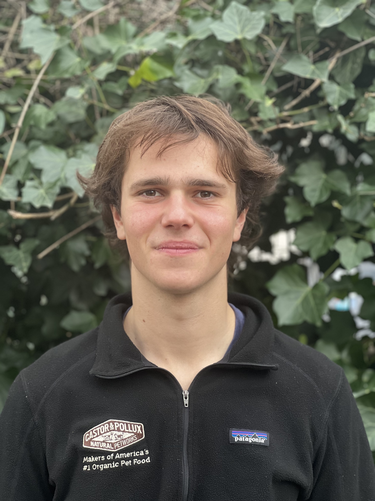

# Wolf Vierbergen

    

        
<strong>Date of birth:</strong> 07 Dec. 2002 
        <strong>Living in:</strong> Leuven 
        <strong>Phone:</strong> +32 468 21 51 05 
        <strong>Email:</strong> vierbergen.wolf@gmail.com 
        <strong>LinkedIn:</strong> <a href="https://www.linkedin.com/in/wolf-vierbergen/">www.linkedin.com/in/wolf-vierbergen/</a>

    

    

        
    

## EDUCATION

**KU Leuven, Leuven** — *Master of Electromechanical Engineering Technology*  
September 2024 - present

**Universiteit Antwerpen, Antwerp** — *Bachelor of Electromechanical Engineering Technology*  
September 2020 - June 2024

## PROJECTS

### EcoQanat — Finalist Sustainable Hospitality Challenge
August 2024 - October 2024
- Worked in a team of 4 to develop a business plan for an innovative idea.
- The project was part of the finals at the Future Hospitality Summit in Dubai.
- Responsible for technical details of a more efficient air-cooling system.
- Pitching the idea to a jury of potential international investors.

### Lens Focusing system — Thermal camera adjustment: [link](/Portfolio-for-Github-pages/Focus-mechanism_readme)
October 2022 - December 2022
- Designed and built a lens focusing system for a thermal camera, featuring precise adjustment and absolute position control.
- Utilised a stepper motor with belt drive and an Arduino for control.

### Automated grow box — Building and implementation: [link](/Portfolio-for-Github-pages/Plant-growing_readme)
October 2021 - June 2022
- Developed a 4-story rack with integrated water plumbing and light distribution as part of a course at University of Antwerp.
- Implemented automation using a Raspberry Pi, relay switches, and soil moisture sensors to control the system.

### CNC machine — Desktop CNC mill
April 2019 - June 2021
- Constructed a 3-axis CNC, utilising an Arduino and stepper motors.
- Developed three iterations to improve stability and performance.

### Wind Tunnel — Constructing and testing a wind tunnel: [link](/Portfolio-for-Github-pages/Windtunnel_readme)
September 2019 - April 2020
- Designed, built, and tested a wind tunnel.
- Achieved the goal of creating and visualising laminar flow.
- Successfully characterised the performance of an aerofoil.

### FabLab Leuven & Rome — Various small projects
2016 - present

## EXPERIENCE

### Internship, Leuven - Donaldson Company
October 2023 - May 2024
- Completed an internship at Donaldson as part of my bachelor's thesis.
- Worked on automating an oil filter test bench using LabVIEW.

### Catering and Hospitality, Leuven & Antwerp
February 2019 - September 2024
- Worked in restaurants: Den Domus, La Favola and KFC.
- Climbing coordinator at De Stordeur.
- Banqueting employee at Hilton Hotel.

## SKILLS

### Hardware
Programmable Logic Controller (PLC), 3D printing, CNC, Arduino.

### Software
Excel, Siemens NX, Autodesk Inventor, Fusion 360, EES, TwinCAT, FluidSIM, LabVIEW, Inkscape.

## LANGUAGES
- Dutch C2
- English C1
- Italian B1
- French A2

## HOBBIES
- Youth movement (Chiro)
- Climbing
- Biking
